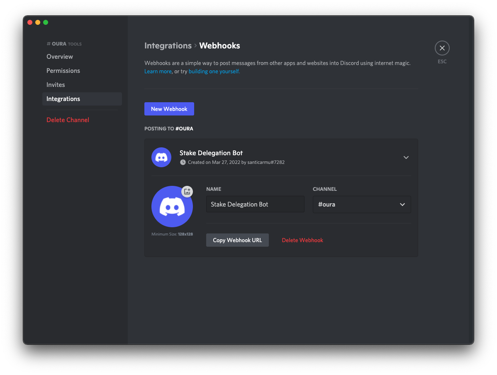
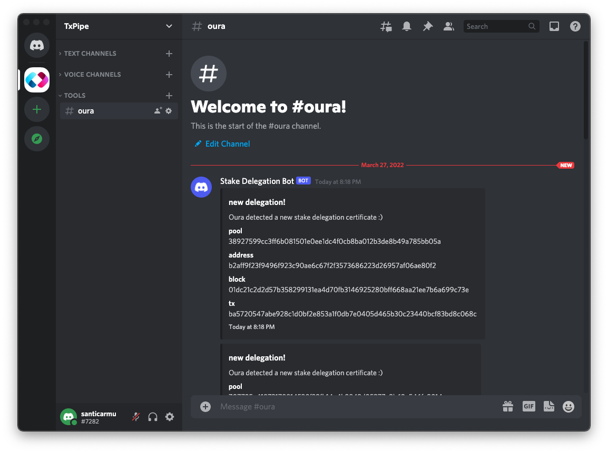

# Discord Stake Bot

A quick & dirty Discord bot to notify Cardano stake delegation events using Oura and NodeJS.

The goal of this repository is to provide an example of how to leverage Oura's raw output using a common command piping mechanism.

DISCLAIMER: This is just a proof-of-concept to use as a starting point. If you're thinking of building something similar, please read [Oura's Documentation](https://txpipe.github.com/oura) to learn about all of the existing integrations options.

## How Does It Work

When you run Oura in `dump` mode, events get send through the stdout in JSON format, one line per event. One way to utilize these events is by piping them into a new command using the shell. In this example, we pipe the data into a NodeJS script that filters and submits a custom message to Discord using a Webhook URL.

## Instructions

1. Clone the repository

```
git clone https://github.com/txpipe/discord-stake-bot
```

2. Install npm dependencies

```sh
cd discord-stake-bot
npm install
```

3. Install Oura following the [instructions](https://txpipe.github.io/oura/installation/index.html) from the documentation.

4. Create a webhook in your Discord channel and copy the URL



5. Edit `post.js` and add your webhook URL where it corresponds.

```js
const hook = new Webhook("<your webhook url>");
```

5. Run the following command to pipe Oura output into the NodeJS script:

```sh
oura dump relays-new.cardano-mainnet.iohk.io:3001 --bearer tcp | node post.js
```

6. Wait until a new delegation event occurs (depends on chain activity, so it might take a while). You should see something like this in your Discord channel:



## DIY Ideas

- put this in a docker image and run it in a server somewhere
- filter events to show only delegations for your pool of interest
- listen to events other than delegation certificate (eg: tx, mint, metadata, etc)
